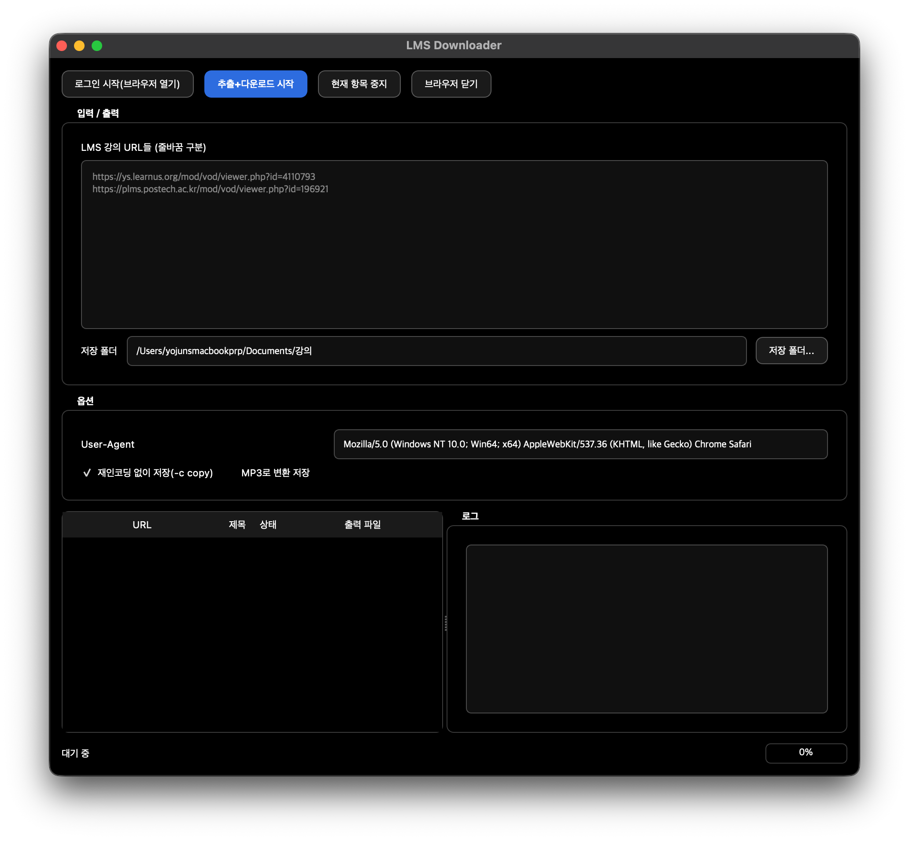

# LMS Downloader

한 번 로그인으로 세션을 유지한 채, 여러 개의 **LMS 강의 페이지 URL**(예: `ys.learnus.org`, `plms.postech.ac.kr`)을 입력하면 **HLS(.m3u8) 영상을 ffmpeg로 순차 다운로드**하는 GUI 툴입니다.



- 로그인: Selenium이 크롬 창을 띄우면 사용자가 직접 로그인
- 추출: `<video><source>` 또는 HTML에서 `.m3u8` URL 탐지
- 다운로드: ffmpeg 사용
- STT(선택): MP3 저장 시 커스텀 Whisper API(매니저앱) 또는 OpenAI 공식 API로 전사해 같은 이름의 `.txt`도 저장

---

## 요구 사항

- **Python** 3.9 이상
- **Google Chrome**
- **ffmpeg**
- 파이썬 패키지: `PyQt5`, `selenium`, `requests`, `python-dotenv`, `websockets`

---

## 설치 & 실행

### 1) macOS

```bash
brew install ffmpeg python uv

터미널 종료 후 재실행 (환경변수 설정 반영)

cd <프로젝트-폴더>
uv sync
source .venv/bin/activate
python3 main.py
```

### 2) Windows

```powershell
winget install Gyan.FFmpeg astral-sh.uv

터미널 종료 후 재실행 (환경변수 설정 반영)

cd <프로젝트-폴더>
uv sync
.\.venv\Scripts\Activate.ps1
python main.py
```

---

## STT (음성 → 텍스트) 설정

엔진과 언어는 **앱 옵션에서** 고르고, 키/토큰은 **`.env`** 에 둡니다.

1. `.env.example` 을 `.env` 로 복사하고 쓸 엔진의 값을 채웁니다.
   - **커스텀 Whisper (매니저앱)**: `CUSTOM_STT_TOKEN` (매니저앱 `/token` 값). `CUSTOM_STT_MODEL` 1=small / 2=medium / 3=large. 긴 강의도 추가 비용 없음. 먼저 실시간 라우트(`/whisper/stream`, NDJSON)를 시도해 세그먼트가 인식되는 대로 상태바·진행 막대를 갱신하고, 로그에는 전사 문장 없이 `[STT] 진행 35% (00:12:30 / 00:33:20)` 형태로 5% 단위 진행률만 남깁니다. 매니저 서버에 그 라우트가 아직 없으면(404) 기존 일괄 방식(`CUSTOM_STT_PROGRESS_URL` 에 pid 등록 후 웹소켓 진행 메시지)으로 자동 폴백합니다. 토큰이 만료되면 401 이 나므로 매니저앱에서 재로그인 후 `/token` 값을 갱신하세요.
   - **OpenAI 공식 API**: `OPENAI_API_KEY`. 기본 모델 `whisper-1` 은 `[HH:MM:SS]` 타임스탬프 포함, 25MB 초과 파일은 자동 10분 분할. 사용량 과금이므로 긴 강의는 비용에 주의.
2. 앱에서 **MP3로 변환 저장** → **STT 텍스트(.txt) 함께 저장** 을 체크합니다.
3. 옆의 **엔진** 드롭다운에서 커스텀 / OpenAI 를, **언어** 드롭다운에서 언어(또는 **자동 감지**)를 고릅니다. 마지막 선택은 앱이 기억합니다. `.env` 에 해당 엔진의 키/토큰이 없으면 라벨에 경고가 뜹니다.
4. 다운로드하면 `제목.mp3` 옆에 `제목.txt` 가 생성됩니다.

전사는 다운로드와 병렬로 백그라운드에서 진행되며, 모든 다운로드·전사가 끝나면 저장 폴더가 열립니다.
